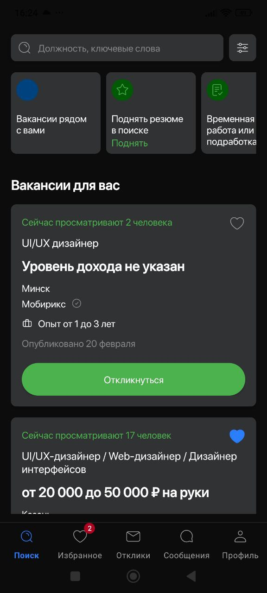
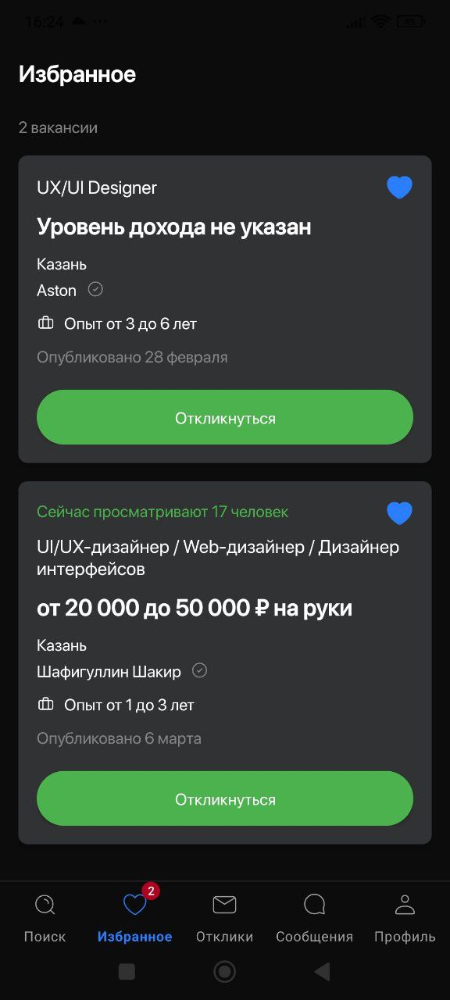
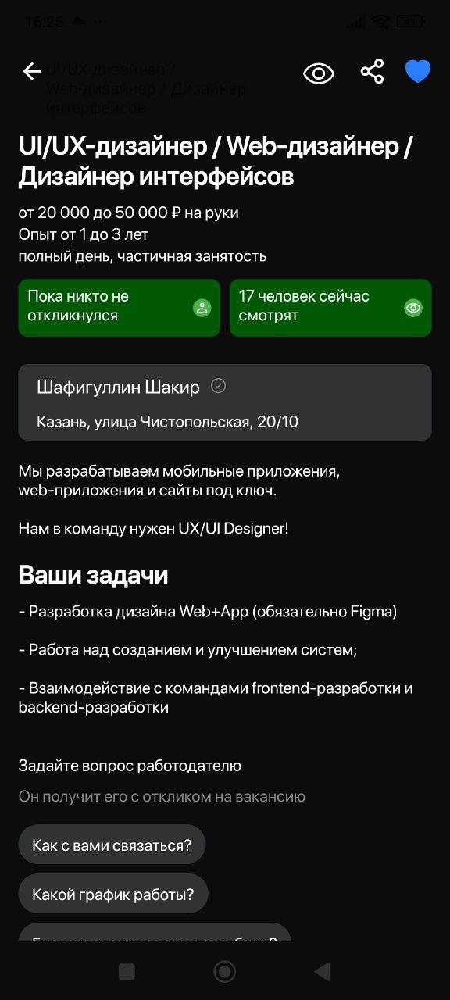

# Тестовое задание для компании E.M.

Это тестовое задание для вакансии Android-разработчика. Приложение было написано за 1 неделю.

## Использованный стек:
- **Kotlin**
- **Корутины**
- **Flow**
- **Koin**
- **MVVM**
- **AdapterDelegates**
- **Верстка на XML**
- **Clean Architecture**
- **Многомодульность**
- **Room**
- **Retrofit**

## Реализовано:

В приложении реализованы 3 экрана:
1. **Поиск вакансий** - экран с возможностью поиска вакансий.
2. **Избранное** - экран с избранными вакансиями, где можно добавлять и удалять вакансии из списка.
3. **Просмотр деталей вакансии** - экран с детальной информацией о вакансии (минимальная функциональность).

### Скриншоты:

- **Поиск вакансий**  
  

- **Избранное**  
  

- **Просмотр деталей вакансии**  
  

## Допущения

- **API:** В ТЗ вместо стандартного API была предоставлена ссылка на скачивание файла с Google Drive, который мокирует ответ от сервера. Поэтому для получения данных о вакансиях приложение использует Retrofit со статической ссылкой на скачивание файла, что ограничивает возможности работы с реальным API, но дает возможность протестировать логику приложения и работы с данными.
- **Проблемы с иконкой:** В макете Figma, который прилагался к заданию, есть проблема с отображением иконки для рекомендации "Вакансии рядом с вами" - отображается только фон. В приложении тоже присутствует этот небольшой визуальный дефект.

## Контакты

Если у вас возникли вопросы, вы можете связаться со мной:
- **Email:** y@basalygina.ru
- **Telegram:** @korrneva

---

Спасибо за внимание к моему тестовому заданию!
